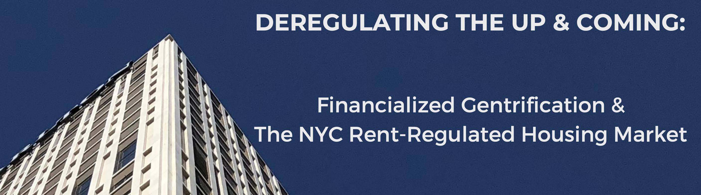
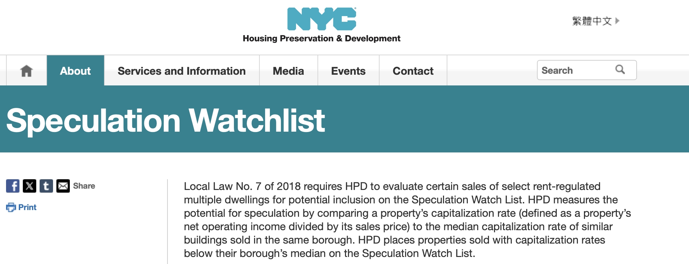
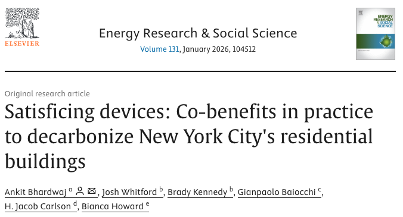
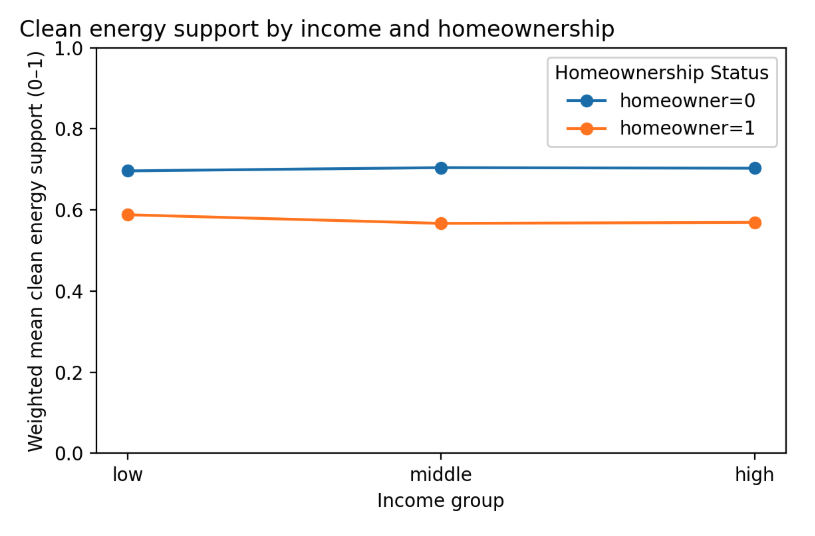
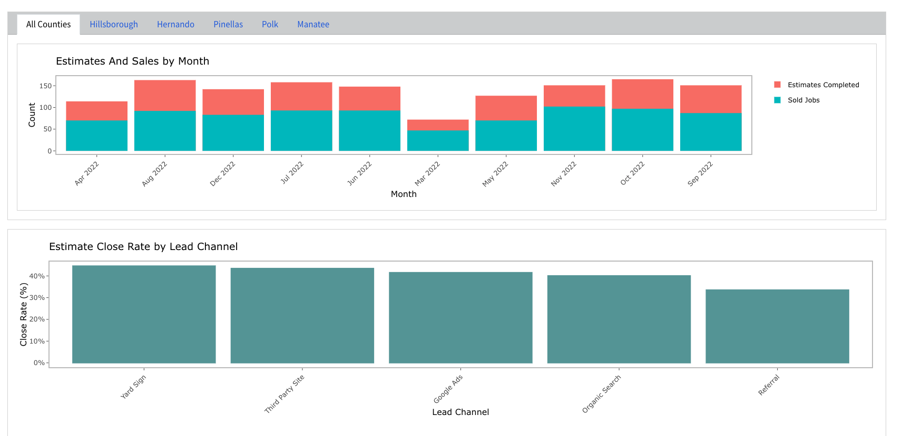
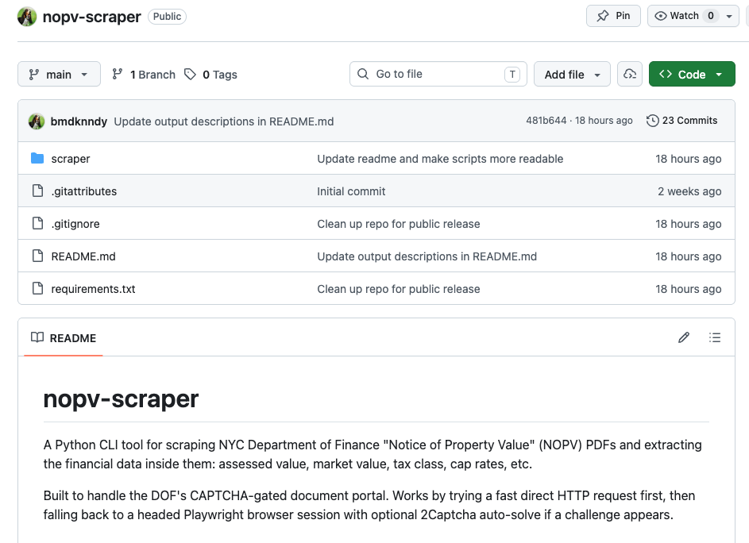
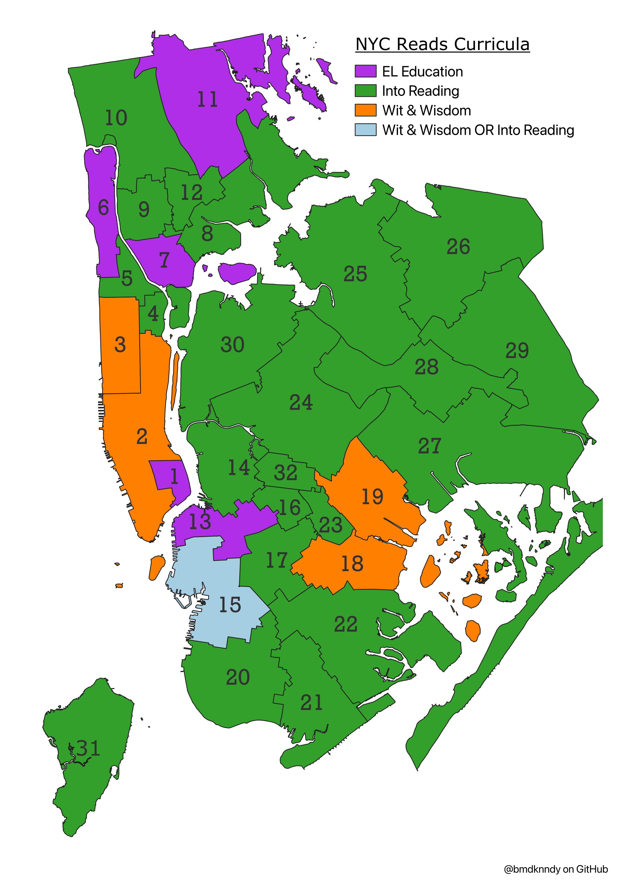

## Public Policy Analysis Projects

### Housing Policy Brief: De-regulating The Up & Coming: Analyzing The Effects of Gentrification on Rent-Regulated Apartments in NYC

[View the analysis (Quarto Site Link)](https://bmdknndy.github.io/DeRegulatingTheUpAndComing/)

-   Analyzes the effects of neighborhood change on change in count of rent-regulated units at the building level using **SQL**, **R,** and **Python,** finding a significant negative effect of gentrification that increases over time. To do this I first scraped property records from NYC DOF website using **Python** (BeautifulSoup4, Selenium, pypdf). I then queried NYC HPD, NYS DHCR, and NYC DCP data using **SQL** (SoQL) from NYC Open Data. I lastly applied time heterogeneous difference-in-differences method in **R** (fixest, MatchIt, iplot). I based my gentrification typology on the event driven framework of bunsen et al. (2023). Maps and visualizations were created in **QGIS** and **R** (ggplot2).

### Housing Policy Brief: Re-Measuring Speculation, Evictions, and Building Conditions in NYC’s Rent-Regulated Housing

[View the analysis (Quarto Site Link)](https://bmdknndy.github.io/HPD-SpeculationWatchList-Analysis/analysis/brief.html)

-   Evaluates whether New York City’s Speculation Watchlist (SWL) successfully identifies purchases of rent-regulated buildings that are followed by worse outcomes for tenants and whether the methodology can be improved using data the city already collects. Uses NYC HPD, NYS DHCR, and NYC DCP data queried via **SQL** (SoQL) from NYC Open Data to deploy a causal inference (DiD) approach to compare the official SWL definition to an alternative, neighborhood-relative (NTA-level) approach in **R** (fixest, iplot). Maps and visualizations were created in **QGIS** and **R** (ggplot2).

------------------------------------------------------------------------

### Climate Policy Journal Article & Policy Memo: Satisficing Devices: Co-benefits in practice to decarbonize New York City's residential buildings

[Read the peer-reviewed article (DOI Link)](https://doi.org/10.1016/j.erss.2025.104512)

-   Draws on 58 interviews and ethnographic work with NY based building sector stakeholders to understand conceptions of value around building decarbonization and decision making around compliance with local decarbonization mandates. Semi-structured interviews and ethnographic observation analyzed in **Atlas.ti** (Qualitative coding & visualization software similar to **nVivo**). Prior to publication in ERSS, this research was presented at the American Sociological Association (ASA) Annual Meeting in 2025 and the Eastern Sociological Society (ESS) Annual Conference in 2025.

[Read the policy memo (PDF)](assets/CoBMemo.pdf)

-   3-page policy memo that draws on my published social science research (see above) on the co-benefits of building decarbonization to present policy implications for city and state policymakers.

### Climate Policy Brief: Understanding The Relationship Between Homeownership and Support for Clean Energy Policies Using CES Survey Data

[View the analysis (Quarto Site Link)](https://bmdknndy.github.io/HomeOwnershipClimatePolicySupport/brief/brief.html)

-   Using nationally representative survey data from the 2024 Cooperative Election Study (CES) analyzed via **Python** and **SQL**, I show that homeownership is associated with lower support for clean energy policies even after accounting for political orientation and standard socioeconomic controls. This pattern suggests that climate attitudes may reflect not only ideology, but also individuals’ positions within housing and asset structures that shape exposure to regulation and perceived costs.

## Business Data Analytics

### KPI Dashboard

[View the KPI Dashboard (Quarto Site Link)](https://bmdknndy.github.io/KPI-Dashboard-FenceCo/)

-   Created KPI dashboard using **R** and **Tableau** to track sales conversions, job profitability, sales by geographic area and product type, lead times, customer acquisition costs, and cash flow. Tailored to management needs and preferences to concisely communicate necessary info on business health.

## Data Science Projects

### Web Scraping: Python CLI tool for scraping NYC Department of Finance "Notice of Property Value" (NOPV) PDFs

[View the GitHub repo)](https://bmdknndy.github.io/NYC-Reads-Map-Dataset-Creation/)

-   Built a **Python** **CLI** tool for scraping NYC Department of Finance "Notice of Property Value" (NOPV) PDFs and extracting the financial data inside them: assessed value, market value, tax class, cap rates, etc.Built to handle the DOF's CAPTCHA-gated document portal. Works by trying a fast direct HTTP request first, then falling back to a headed Playwright browser session with optional 2Captcha auto-solve if a challenge appears.

### Data Engineering & OCR Tool: “NYC Reads” Program Dataset & Map Creation for Goddard Riverside Community Center Staff & Volunteers

[View the map & searchable data set (Quarto Site Link)](https://bmdknndy.github.io/NYC-Reads-Map-Dataset-Creation/)

::::: columns
::: {.column width="50%"}

:::

::: {.column width="50%"}
-   Created school-level dataset and map via **Python**, **R**, and **QGIS** for use by educational staff and volunteer tutors at Goddard Riverside to determine the curriculum used by the students they serve based on 2024 NYC Department of Education updates to citywide reading curricula. Queried school information from NYC DOE using **Python** (nycschools) and extracted curricula from an image provided by DOE using OCR in R (tesseract). Visualized district-level map in **R** (ggplot2, sf) and **QGIS**.
:::
:::::
